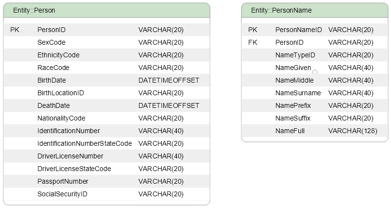

## Datovy Data Model Visualization
# EDAM Data Model Visualization Console

## INTRODUCTION
The purpose of this effort is to provide free and accessible Data Model 
visualization tool that fully integrates with EDAM 
(see https://github.com/esobrino/Datovy.Edam) but is written without any
dependency to parent project.

As a starting point graphic primitives will be tailored to manage expected ERD 
diagrams and models.  As the effort progresses other Data Modeling areas are 
expected to be considered.

There are a plethora of excellent JavaSript graphics and diagraming libraries 
that could had been used instead of developing a new one and a number of those 
where explored and tried still the nature of the modeling theme of this project
pointed us in a different direction.  Developing data modeling primitives
as envision using any library more or less required a substantial effort as 
I hope it will be evident in this first effort targeting the Uno Platform and 
using the SKIA Graphics Engine.

We hope that the end result will be a library to prepare ERD and/or other
data model diagrams creating nice-looking and easy to understand graphics in a 
small and fast WebAssembly application that could be run everywhere.

## ISA WEBASSEMBLY APP

This is a graphics console application based on the Uno Platform and 
specifically WebAssembly (see https://platform.uno/webassembly/) Web 
Application (WebApp) and Windows WinUI.  The ModelWinUI Visual Studio solution
is specific to Windows WinUI and presented in a separate project but as a siblig 
of the related WebAssembly WebApp.  It is substantially faster developing the 
Application as a WinUI desktop application, code that will be copied as is into
its Uno WebApp siblig as needed.

## USES SKIA
SKIA Graphics Engine (see https://skia.org/) is the base library to 
do all the graphics in WinUI and WebAssembly using SkiaSharp 
(see https://github.com/mono/SkiaSharp) library.  This library run on both the
Uno Platform WebAssembly and the Windows WinUI and code can be moved and 
reuse as is and without any kind of tailoring.

## DATA MODELING
As a starting point the Data Model offering is based on "structured data" and 
related relational constructs.  Code to support the description and definition
of a Database based on a Catalog, Schema, Tables and Columns are first class 
citizens and services/interfaces to allow sending and receiving those using 
JSON messages/documents will be provided.

## ROAD MAP
The following is a tentative plan that will be modified based on the community feedback:
1) Prepare a ERD data modeling base code library to define and draw Table and constraints
connectors (lines/symbols).  At this point Table graphics representations basic 
ERD diagrams could be prepared by writing code.
2) Develop necessary UI controls to help viewing the data model.
3) Prepare non-trivial sample models that will be shipped with different
versions to show the tool capabilies.
4) Assess next steps as possible contributions are presented.

## CONTRIBUTE
We hope that this project is useful for others in search of an open platform 
for "Data Model Visualizaion" for now at a starting point.  With that
in mind help us shape the future of this project, we will greatly appreciate 
any help in any form.

## CONTACT-US
Anything useful to say about the project?  Contact us at:

Eduardo - ed.sobrino@openk.com
Pravin - tpravin@datovy.com
